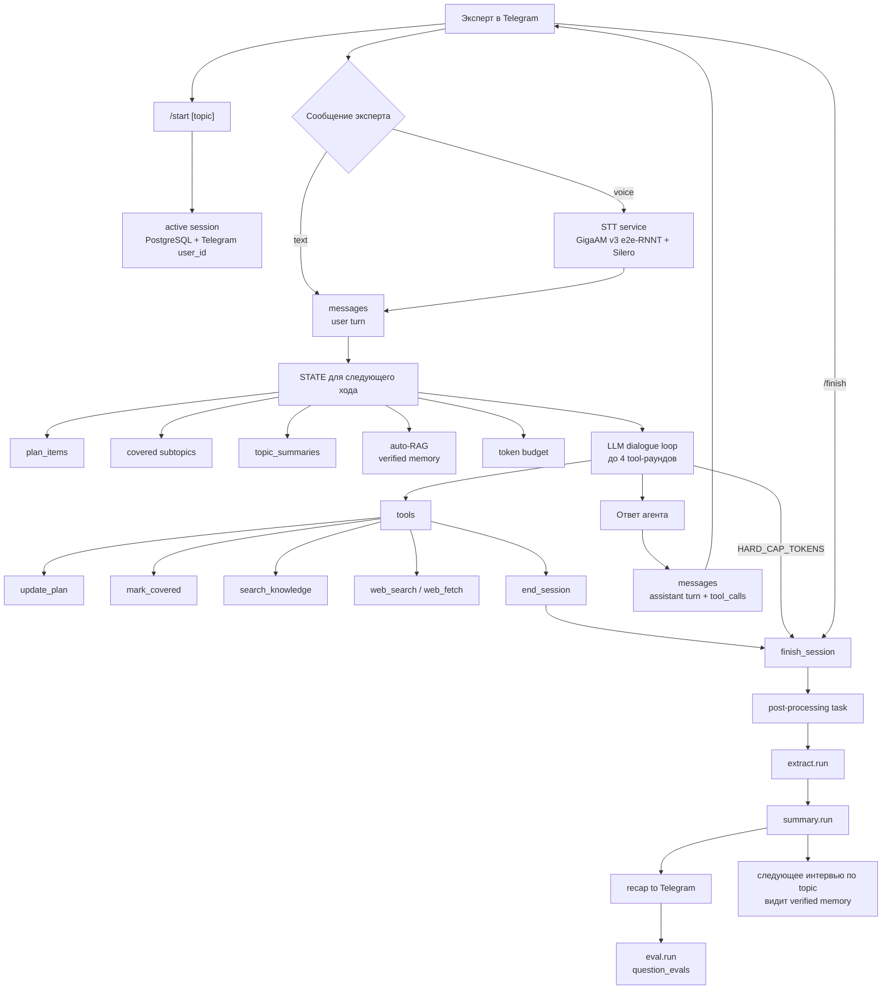
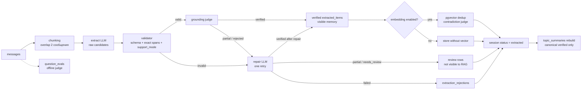

# SverhAgent

Telegram-агент для сбора экспертных знаний. Он ведет интервью, сохраняет сырой
транскрипт, вытаскивает из него проверяемые факты и использует накопленную
память в следующих интервью по той же теме.

Проект сейчас закрывает контур **сбора знаний**: интервью → структурированная
память → сводка по теме → более точные следующие вопросы. Отдельный
пользовательский RAG/LoRA-продукт поверх этой базы не входит в текущий скоуп,
но данные уже раскладываются в пригодный для этого формат.

## Как работает агент

Главная идея: агент не просто задает вопросы и пишет лог. Каждый ответ эксперта
становится частью управляемого процесса: сначала он попадает в неизменяемый
транскрипт, затем проходит валидацию, grounding и только после этого становится
видимой памятью для следующих интервью.



### Один ход интервью

1. Эксперт присылает текст или голосовое сообщение.
2. Бот сохраняет сообщение в `messages`.
3. `src.state` собирает компактный `STATE`: план, прогресс, краткую сводку
   прошлых сессий, релевантные факты из базы и бюджет токенов.
4. `src.llm` вызывает чат-модель через OpenAI-compatible `/v1` endpoint.
5. Модель может вызвать инструменты:
   - `update_plan` — заменить план интервью;
   - `mark_covered` — отметить подтему закрытой;
   - `search_knowledge` — найти похожие verified-факты по теме;
   - `web_search` / `web_fetch` — проверить внешний факт через Tavily;
   - `end_session` — закончить интервью с финальным резюме.
6. Ответ агента и список tool calls сохраняются в БД.
7. Если достигнут `HARD_CAP_TOKENS`, сессия закрывается принудительно.

### Что попадает в память

После `/finish` или `end_session` запускается post-processing:



Правила видимости намеренно жесткие:

| Слой | Для чего нужен | Видно агенту в следующих интервью |
|------|----------------|------------------------------------|
| `messages` | неизменяемый сырой транскрипт | нет, только через derived-слои |
| `extracted_items` `verified` | канонические факты, Q&A, термины | да |
| `extracted_items` `partial/needs_review` | спорные или неполные извлечения | нет |
| `extraction_rejections` | диагностика плохих кандидатов модели | нет |
| `topic_summaries` | краткая память по теме | да |
| `legacy` rows | старые записи после миграций | нет, пока не пройдут re-grounding |

Это защищает базу от типичной ошибки: цитата доказывает, что фраза была
сказана, но не доказывает, что весь нормализованный payload из нее следует.
Поэтому каждый item хранит provenance spans, `support_mode`,
`grounding_status`, `grounding_version` и версию текста для embeddings.

## Установка

Самый простой путь рассчитан на Windows: бот запускается локально, Postgres
поднимается в Docker, модели можно скачать одной галочкой `-WithModels`.

Сначала поставьте:

- Python 3.12;
- Docker Desktop или другой Docker daemon для Postgres;
- Git;
- `ffmpeg` в `PATH`, если нужны Telegram voice messages;
- Telegram bot token от BotFather;
- OpenAI-compatible чат-сервер с `/v1` API: vLLM, llama.cpp, LM Studio, TGI или
  свой gateway.

Дальше:

```powershell
git clone https://github.com/ovosh2281337/SverhAgent.git
cd SverhAgent

# Всё поставить, поднять Postgres и скачать локальные модели проекта:
powershell -ExecutionPolicy Bypass -File scripts\setup.ps1 -WithModels

# Открыть .env и заполнить минимум:
# TELEGRAM_BOT_TOKEN=...
# OPENAI_BASE_URL=http://localhost:8000/v1
# DIALOG_MODEL=...
notepad .env

# Проверить, что конфиг читается и запуск не упадет сразу:
powershell -ExecutionPolicy Bypass -File scripts\run.ps1 -PreflightOnly

# Запустить бота:
powershell -ExecutionPolicy Bypass -File scripts\run.ps1
```

Если голосовые и локальный RAG не нужны, можно поставить без моделей:

```powershell
powershell -ExecutionPolicy Bypass -File scripts\setup.ps1
```

Что делает `setup.ps1 -WithModels`:

1. проверяет Python 3.12;
2. создает `.venv`;
3. ставит `requirements.txt`;
4. копирует `.env.example` в `.env`, если файла еще нет;
5. поднимает `db` из `docker-compose.yml`;
6. ставит optional embedding extra и скачивает `microsoft/harrier-oss-v1-270m` для embeddings/RAG;
7. ставит STT extra и кэширует GigaAM v3 e2e-RNNT `v3_e2e_rnnt` + Silero VAD.

Флаги установки:

```powershell
powershell -File scripts\setup.ps1                 # база без локальных моделей
powershell -File scripts\setup.ps1 -WithModels     # Harrier + GigaAM v3 e2e-RNNT + Silero
powershell -File scripts\setup.ps1 -WithEmbeddings # только Harrier embeddings
powershell -File scripts\setup.ps1 -WithStt        # только GigaAM v3 e2e-RNNT + Silero
powershell -File scripts\setup.ps1 -SkipDocker     # если Postgres уже поднят
```

## Docker

Compose может запустить и Postgres, и бота:

```bash
cp .env.example .env
# заполнить TELEGRAM_BOT_TOKEN, OPENAI_BASE_URL и DIALOG_MODEL
docker compose up --build
```

Внутри контейнера `localhost` указывает на сам контейнер. Если LLM-сервер
работает на хосте:

```env
OPENAI_BASE_URL=http://host.docker.internal:8000/v1
```

То же правило для внешних embeddings/STT-сервисов на хосте:

```env
EMBED_MODE=external
EMBED_BASE_URL=http://host.docker.internal:8300/v1
STT_BASE_URL=http://host.docker.internal:8301
```

`docker-compose.yml` сам переопределяет `DATABASE_URL` на хост `db`.
Docker-образ ставит только базовые зависимости бота: bundled embeddings/STT в нем не
стартуют и optional model extras не устанавливаются. Для контейнерного запуска используйте
`EMBED_MODE=disabled` или внешний endpoint с `EMBED_MODE=external`.

Частые compose-команды:

```bash
docker compose up -d db
docker compose up --build
docker compose logs -f bot
docker compose down
docker compose down -v   # удаляет том Postgres и всю локальную БД
```

## Конфигурация

Минимально нужны Telegram token и OpenAI-compatible чат-сервер:

| Переменная | Обязательна | Описание |
|------------|-------------|----------|
| `TELEGRAM_BOT_TOKEN` | да | токен от BotFather |
| `OPENAI_BASE_URL` | да | `/v1` endpoint: vLLM, llama.cpp, LM Studio, TGI, gateway |
| `OPENAI_API_KEY` | нет | ключ для endpoint, для локального сервера обычно `local` |
| `DIALOG_MODEL` | да | чат/instruct-модель для интервью |
| `EXTRACT_MODEL` | нет | модель извлечения фактов |
| `SUMMARY_MODEL` | нет | модель пересборки сводки |
| `EVAL_MODEL` | нет | модель оценки вопросов агента |
| `GROUND_MODEL` | нет | semantic judge для grounded extraction |
| `DATABASE_URL` | нет | Postgres DSN, по умолчанию `localhost:5432/kb` |
| `SOFT_CAP_TOKENS` | нет | мягкий лимит: агент просит себя закругляться |
| `HARD_CAP_TOKENS` | нет | жесткий лимит: сессия закрывается |
| `TAVILY_API_KEY` | нет | включает `web_search` и `web_fetch` |
| `STT_BASE_URL` | нет | включает обработку Telegram voice через локальный STT service |

`temperature` и `max_tokens` клиент не отправляет: настройки остаются на стороне
LLM-сервера.

## Embeddings и RAG-память

Embeddings опциональны. Без них интервью, extraction и summary работают, но
`search_knowledge`, vector dedup и auto-RAG отключены.

Режимы:

| `EMBED_MODE` | Поведение |
|--------------|-----------|
| `disabled` | векторные функции выключены |
| `bundled` | `scripts\run.ps1` поднимает локальный harrier endpoint |
| `external` | используется внешний OpenAI-compatible embeddings endpoint |

Локальный bundled mode:

```powershell
powershell -File scripts\setup.ps1 -WithEmbeddings

# .env
EMBED_MODE=bundled
EMBED_BASE_URL=

powershell -File scripts\run.ps1
```

Внешний endpoint:

```env
EMBED_MODE=external
EMBED_BASE_URL=http://localhost:8300/v1
```

Bundled модель — `microsoft/harrier-oss-v1-270m`. Это embedding-модель, она не
может вести диалог; для интервью все равно нужен отдельный `DIALOG_MODEL`.
Чат/instruct-модель проект не скачивает: ее нужно поднять отдельно за
OpenAI-compatible endpoint и указать в `.env`.

## Голосовые сообщения

Текстовый режим работает без STT. Голосовые сообщения включаются отдельно:

```powershell
# если setup запускался без -WithModels / -WithStt:
powershell -File scripts\setup.ps1 -WithStt

# затем поднять STT-сервис отдельным процессом
.\.venv\Scripts\python.exe -m scripts.serve_stt
```

После старта STT-сервиса:

```env
STT_BASE_URL=http://localhost:8301
STT_MAX_VOICE_SEC=600
STT_MAX_SEC=900
```

`STT_MAX_VOICE_SEC` ограничивает Telegram voice на стороне бота, `STT_MAX_SEC` ограничивает
загруженное аудио на стороне STT-сервиса.

`scripts.serve_stt` использует GigaAM v3 e2e-RNNT `v3_e2e_rnnt`, Silero VAD и `ffmpeg`. Бот сам модель
STT не грузит: он отправляет аудио в локальный HTTP endpoint
`POST /v1/transcribe`.

## Подключение к базе знаний

База знаний хранится в Postgres. Локальные значения по умолчанию:

```env
DATABASE_URL=postgresql://kb:kb@localhost:5432/kb
```

Подключиться через psql внутри контейнера:

```bash
docker compose exec db psql -U kb -d kb
```

Подключиться с хоста, если `psql` установлен локально:

```bash
psql "postgresql://kb:kb@localhost:5432/kb"
```

Миграции применяются автоматически при старте бота. Вручную:

```bash
python -m src.db migrate
```

Главные таблицы:

| Таблица | Что хранит |
|---------|------------|
| `sessions` | интервью, тема, статус, Telegram identity, токены |
| `messages` | неизменяемый транскрипт и tool calls |
| `plan_items` | текущий план интервью |
| `extracted_items` | извлеченные факты/Q&A/термины и их visibility status |
| `extracted_item_provenance` | точные spans в `messages`, подтверждающие item |
| `extraction_rejections` | отклоненные кандидаты extraction/grounding |
| `topic_summaries` | пересобранные сводки по темам |
| `question_evals` | оценки качества вопросов агента |

Готовые команды просмотра обычно удобнее сырого SQL:

```bash
python -m scripts.view default
python -m scripts.export default kb_default.md
python -m scripts.stats
```

Полезные SQL-запросы:

```sql
SELECT id, topic, expert_name, status, tokens_used, created_at, finished_at
FROM sessions
ORDER BY id DESC
LIMIT 20;

SELECT topic, generated_at, summary
FROM topic_summaries
ORDER BY generated_at DESC;

SELECT e.id, s.topic, e.type, e.origin, e.support_mode,
       e.grounding_status, e.confirmation_count, e.payload
FROM extracted_items e
JOIN sessions s ON s.id = e.session_id
WHERE s.topic = 'default'
ORDER BY e.id;
```

Для production-RAG обычно берите только опубликованную память:

```sql
SELECT e.id, e.type, e.payload, e.confirmation_count
FROM extracted_items e
JOIN sessions s ON s.id = e.session_id
WHERE s.topic = 'default'
  AND s.status = 'extracted'
  AND e.duplicate_of IS NULL
  AND e.grounding_status = 'verified'
ORDER BY e.id;
```

## Команды

Post-processing обычно запускается ботом автоматически, но команды можно
вызвать вручную:

### Telegram

| Команда | Назначение |
|---------|------------|
| `/start [topic]` | начать интервью; без темы используется `default` |
| `/plan` | показать план и покрытие подтем |
| `/finish` | закрыть интервью и запустить extraction/summary/eval |
| `/verbose` | включить/выключить отладочный вывод tool calls, STATE и post-processing trace |
| `/reset` | удалить активную сессию пользователя |

### Запуск и проверки

```powershell
powershell -File scripts\setup.ps1
powershell -File scripts\setup.ps1 -SkipDocker
powershell -File scripts\setup.ps1 -WithModels
powershell -File scripts\setup.ps1 -WithEmbeddings
powershell -File scripts\setup.ps1 -WithStt

powershell -File scripts\run.ps1
powershell -File scripts\run.ps1 -PreflightOnly
powershell -File scripts\run.ps1 -EmbedReadyTimeoutSec 300
```

```bash
python -m scripts.preflight runtime
python -m scripts.preflight config
python -m scripts.preflight config --docker
python -m scripts.preflight launcher-env
python -m scripts.preflight launcher-env --json
python -m scripts.preflight model
python -m scripts.preflight model --model-dir models/harrier-oss-v1-270m
python -m scripts.preflight port-free --host 127.0.0.1 --port 8300
python -m scripts.preflight health --url http://127.0.0.1:8300/health
```

### База знаний и jobs

```bash
python -m src.db migrate
python -m src.jobs.extract <session_id>
python -m src.jobs.extract <session_id> --reground
python -m src.jobs.summary <topic>
python -m src.jobs.eval <session_id>
python -m scripts.reground_legacy --dry-run
python -m scripts.reground_legacy --topic default --verbose
python -m scripts.reground_legacy --limit 3 --no-summary
python -m scripts.view <topic>
python -m scripts.stats
python -m scripts.export <topic>
python -m scripts.export <topic> <outfile>
python -m scripts.backfill_embeddings
python -m scripts.backfill_embeddings --stale
python -m scripts.backfill_embeddings --all
```

### Локальные model services

```bash
python -m scripts.download_model
python -m scripts.serve_embed
python -m scripts.serve_stt
```

### Self-test

`scripts.selftest` гоняет реального агента, а эксперт симулируется чат-моделью:

```bash
python -m scripts.selftest
python -m scripts.selftest --topic selftest --persona fdm --turns 8
python -m scripts.selftest --persona brew --turns 12 --postprocess
```

## Тесты

Тесты написаны на стандартном `unittest`:

```powershell
.\.venv\Scripts\python.exe -m unittest discover -s tests -v
```

Проверяются:

- validation/grounding pipeline для extracted items;
- visibility gates для RAG и summaries;
- health/degraded поведение embeddings;
- lifecycle locks вокруг `/finish`, `/reset` и входящих сообщений;
- Telegram identity по `user_id`, а не display name;
- preflight и PowerShell launcher scripts.

## Структура проекта

```text
src/
  agent.py          один ход интервью: STATE -> LLM loop -> запись результата
  bot.py            Telegram handlers, lifecycle locks, post-processing trigger
  config.py         env parsing и режимы embeddings/STT/search
  db.py             asyncpg wrapper, миграции, memory queries
  embed.py          OpenAI-compatible embeddings client + health metrics
  llm.py            OpenAI-compatible chat client и tool loop
  prompts.py        системные промпты интервью, extraction, grounding, eval
  state.py          сбор компактного STATE для модели
  tools.py          tool schemas и применение tool calls
  websearch.py      Tavily search/fetch adapter
  jobs/
    extract.py      transcript -> grounded extracted_items
    summary.py      пересборка topic_summaries
    eval.py         оценка вопросов агента

scripts/
  setup.ps1         venv, dependencies, .env, Postgres, optional model weights
  run.ps1           строгий launcher с preflight, mutex и watchdog
  preflight.py      проверки runtime/config/model/ports/health
  serve_embed.py    локальный embeddings endpoint
  serve_stt.py      локальный STT endpoint
  selftest.py       end-to-end симуляция интервью
  view.py           просмотр extracted memory
  stats.py          наблюдаемость по сессиям
  export.py         экспорт базы знаний темы в Markdown

migrations/         SQL-миграции PostgreSQL/pgvector
tests/              unit/integration-style тесты без живого Telegram/LLM
```

## Границы текущего прототипа

- Голосовые сообщения поддерживаются только при отдельно поднятом STT endpoint.
- Web search включается только при наличии `TAVILY_API_KEY`.
- Пользовательский RAG/LoRA слой поверх собранной базы не реализован.
- GraphRAG намеренно не добавлен: на масштабе десятков или сотен записей
  typed items + pgvector + связи `duplicate_of`/`contradicts` проще и надежнее.
